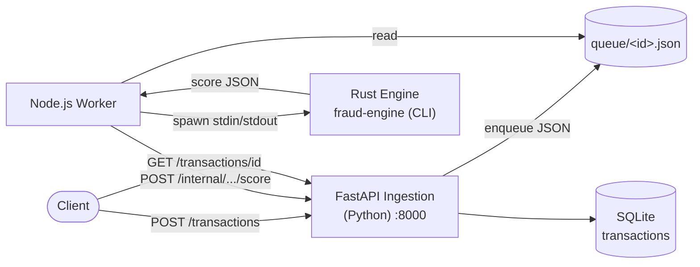
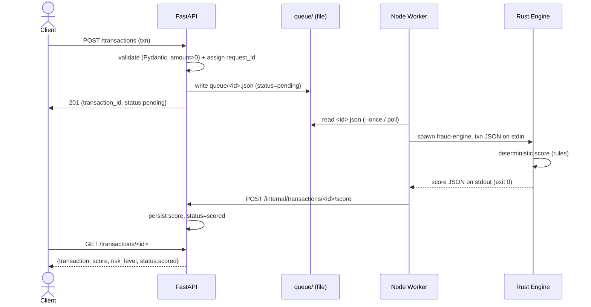
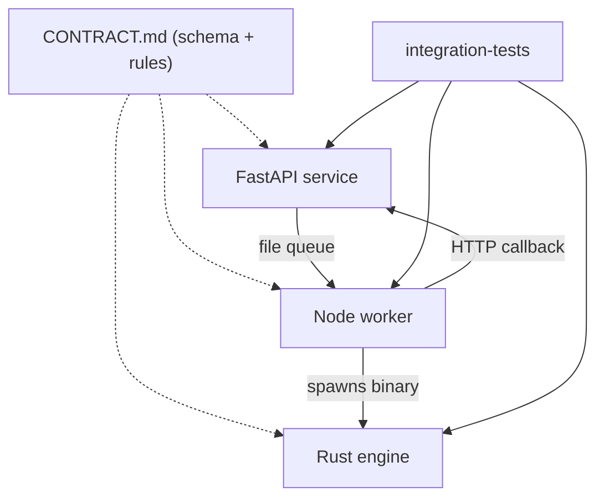
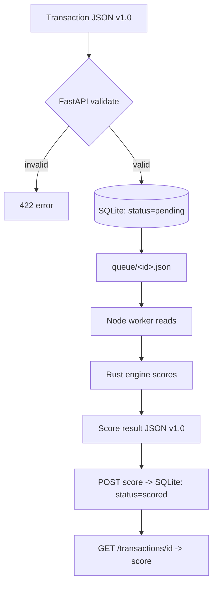

# A3 — Polyglot Fraud-Score System

> A distributed fraud-scoring system across **three languages**: FastAPI (Python) ingestion +
> Node.js worker + Rust scoring engine, integrated via a file queue + HTTP callback.
> Built by 3 parallel component agents against a locked contract (`CONTRACT.md`); integrated, run,
> and **verified end-to-end** by the coordinator. Date: 2026-06-17 (hardened 2026-06-21).
> Toolchains (pinned in `mise.toml`, captured in `artifacts/repro/`): Python **3.12.7** (service venv) ·
> Node **26.3.0** · Rust **1.96.0**. Test counts are regenerated by `scripts/capture_verification.sh` —
> never hand-edited.

---

## Architecture



- **Component isolation:** three independently deployable units, three languages, one shared JSON
  contract. The Rust engine is the **single source of truth** for scoring; FastAPI and Node orchestrate.
- **Integration:** file queue (no external broker) + HTTP callback to persist the score.

## Sequence Diagram



## Component Dependency Diagram



## Data Flow Diagram



---

## Data Contracts

Versioned (`schema_version: "1.0"`), defined once in `CONTRACT.md`, used by all three components.

**Transaction:** `transaction_id, user_id, amount(>0), country(home=IN), merchant_category, timestamp(ISO-8601)`.
**Score result:** `transaction_id, score(0–100), risk_level(low/medium/high), reasons[]`.
(Full field tables in `CONTRACT.md`.)

## Scoring Rules (deterministic — Rust engine only)

| Condition | Points | Reason |
|---|---|---|
| `amount > 10000` | +40 | `high_amount` |
| `country != "IN"` | +20 | `foreign_country` |
| `merchant_category ∈ {gambling, crypto, jewelry, wire_transfer}` | +30 | `high_risk_merchant` |

Clamp `[0,100]`; `risk_level`: `<30 low · 30–69 medium · ≥70 high`.

## Failure Modes & Handling

| Failure | Component | Handling |
|---|---|---|
| Invalid request (amount≤0, missing field) | FastAPI | `422 {"error":...}` / Pydantic validation; never enqueued |
| Malformed transaction JSON in queue | Worker | caught; file moved to `failed/`; no crash |
| Rust engine error / non-zero exit | Worker | **retry up to 3×** with backoff; then move to `failed/` |
| Malformed engine stdout | Worker | reject + handled (test-covered), no crash |
| Engine bad input | Rust | error JSON to stderr, exit 1, **no panic** |
| API unreachable on callback | Worker | POST fails → logged; file not marked processed (re-attempted) |
| Unknown transaction id | FastAPI | `404` on GET and on score callback |

## Testing Strategy

- **Rust (`cargo test`):** **7** — 4 canonical vectors + clamp ceiling + `>10000` threshold boundary
  (A5-4: `==10000` is NOT high_amount) + malformed/missing-field input (Err, no panic).
- **FastAPI (`pytest`):** **22** — health + readiness (200/503), valid POST + queue-file written,
  amount≤0 → 422, missing field → 422, GET 404, score callback persists + status=scored; plus the A5
  hardening regressions (path traversal → 422, duplicate id → 409, fail-closed internal auth 401/503,
  score-poisoning / band-mismatch / id-mismatch → 422, idempotent replay vs overwrite-409, TOCTOU race
  → 409) and the A3 ingest-key on/off tests.
- **Node (`jest`):** **14** — engine spawn success/retry/failure, **A5-7 timeout-kills-hung-engine**,
  **A5-10 output-cap**, postScore URL+body+token header, processFile happy/malformed paths, queue summary
  (fully mocked — no real engine/API).
- **Contract conformance (`scripts/contract_conformance.sh`):** the 4 canonical vectors driven straight
  through the real Rust binary — the narrow "engine still matches CONTRACT.md" gate.
- **Integration (`integration-tests/run_integration.sh`):** real FastAPI + real worker + real Rust binary;
  4 canonical transactions end-to-end; asserts persisted score/risk/status. Hardened against stale-server
  false-passes (frees the port, verifies bind, asserts queue depth == 4).

---

## Integration Results (VERIFIED — executed)

```text
# Rust
$ cargo test            -> 7 passed
$ echo '{...15000/US/gambling...}' | ./target/release/fraud-engine
   {"schema_version":"1.0","transaction_id":"t1","score":90,"risk_level":"high",
    "reasons":["high_amount","foreign_country","high_risk_merchant"]}

# FastAPI
$ pytest -q             -> 22 passed

# Node
$ npm test              -> 14 passed

# End-to-end (integration-tests/run_integration.sh)
queued files: 4
  txn_base     score=0  risk=low     status=scored  expect=0/low      PASS
  txn_high     score=40 risk=medium  status=scored  expect=40/medium  PASS
  txn_foreign  score=20 risk=low     status=scored  expect=20/low     PASS
  txn_all      score=90 risk=high    status=scored  expect=90/high    PASS
INTEGRATION: PASS   (exit 0)
```

### Sample request / response
```text
$ curl -X POST localhost:8000/transactions -d '{"transaction_id":"txn_all","user_id":"u1",
    "amount":15000,"country":"US","merchant_category":"gambling","timestamp":"2026-06-17T10:00:00Z"}'
  -> 201 {"transaction_id":"txn_all","status":"pending","request_id":"<uuid>"}
# (worker runs) then:
$ curl localhost:8000/transactions/txn_all
  -> {"transaction":{...},"score":90,"risk_level":"high","status":"scored"}
```

## Security posture (post-A5 hardening)

- **`/internal/.../score` is FAIL-CLOSED** (A5-2 / A5-17 / A5-19): it requires `A3_INTERNAL_TOKEN`
  (constant-time compare). With no token configured it returns **503** to *all* callers — there is no
  config in which it is reachable unauthenticated. The worker must share the same token.
- **Score integrity** (A5-13/14/15): server rejects out-of-range scores, band/score mismatches, and
  path/body id mismatches; an already-scored txn is idempotent on replay but **409 on a conflicting
  re-score** — a high-risk score cannot be silently flipped to low.
- **Path traversal** (A5-1): `transaction_id` is regex-bounded *and* the queue path is realpath-checked.
- **Engine sandboxing** (A5-7/10): the worker kills a hung engine after `ENGINE_TIMEOUT_MS` and caps
  engine stdout at `MAX_OUTPUT_BYTES`, so a misbehaving binary can't stall the loop or OOM the worker.
- **Optional public-ingest key** (A3-012): `POST /transactions` is open in demo mode but enforces an
  `X-API-Key` when `A3_API_KEY` is set.

## Known Limitations

- **Public `POST /transactions` is open by default** — demo mode. Set `A3_API_KEY` to require a key, or
  front it with a gateway. (The privileged `/internal` callback is *not* open — see above.)
- **File queue, single node:** simple + infra-free, but not multi-consumer/HA. A real broker
  (Redis/SQS/Kafka) would replace `queue/` for scale and at-least-once delivery guarantees — see
  `docs/BROKER_MIGRATION.md` for the migration sketch (deferred).
- **SQLite** single-writer; WAL + a 5s busy-timeout are enabled (a reader can proceed during the score
  write), but swap for Postgres at real scale.
- **Worker callback is best-effort** — if the API is down at callback time the score isn't persisted
  (file moves to `failed/` after retries for re-processing); no dead-letter alerting. See `RUNBOOK.md`.
- **`amount` is an `f64`/float** (A5-4, deferred): money should be integer minor units / `Decimal`. The
  Rust `high_amount_threshold_boundary` test pins the `>10000` contract so a future migration to
  `amount_cents` (CONTRACT v1.1) must preserve it.
- **Scoring rules are fixed** in code (Rust only); a real system would externalize them (rules engine/config).

---

# AGENT GENERATED
- FastAPI service (`fastapi-service/`), Node worker (`node-worker/`), Rust engine (`rust-engine/`),
  authored in parallel by 3 component agents against `CONTRACT.md`.
- Per-component tests; the shared contract; this document + README.

# VERIFIED RESULTS (coordinator-executed, evidence above)
- `cargo test` 7 passed · binary smoke test correct.
- `pytest` 22 passed.
- `npm test` 14 passed.
- **End-to-end integration: 4/4 PASS** (real cross-language flow; scores match contract).

---

## Deliverables Checklist
- [x] FastAPI Service
- [x] Node Worker
- [x] Rust Engine
- [x] Shared Contract (`CONTRACT.md`)
- [x] Tests (Rust 7 · FastAPI 22 · Node 14 · conformance 4/4)
- [x] Integration Test (`integration-tests/run_integration.sh` — 4/4 PASS)
- [x] Architecture Diagrams (architecture, sequence, component-dependency, data-flow)
- [x] README
- [x] Verification Evidence (commands + outputs captured)
- [x] A3_polyglot_system.md (this file)


## Screenshots

**a3 scored transaction**


**a3 swagger docs**


