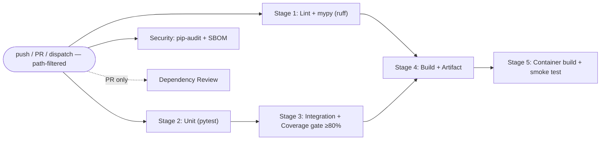

# D3 — Production CI Pipeline (GitHub Actions)

An enterprise-grade GitHub Actions pipeline for a sample FastAPI service:
**Lint+Types → Unit → Integration+Coverage → Build/Artifact → Container (build + smoke test)**, run in
parallel with a **supply-chain security scan** (pip-audit + SBOM) and **dependency review** on PRs.
Hardened end to end: SHA-pinned actions, least-privilege `permissions`, per-job timeouts, path-scoped
triggers, an 80% coverage gate, a multi-stage non-root container, and a container that is actually
**run and smoke-tested** in CI — not merely built.

Workflow lives at the repo root `.github/workflows/ci.yml`; the app under test is here in
`DevOps-Infra/ci-pipeline/`.

> Verified — see `docs/agent-analysis/D3_ci_pipeline_record.md` (green run, failure→fix demo,
> non-root container, coverage gate, security scan, smoke test).

## Pipeline Overview / Architecture


Lint, Unit and Security run in parallel; Integration needs Unit; Build needs Lint+Integration;
Container needs Build (fail-fast via `needs`). Dependency review runs only on pull requests.

## Workflow Stages
| Stage | Job | Command / action | Gate |
|---|---|---|---|
| 1 Lint & Types | `lint` | `ruff check .` + `ruff format --check .` + `mypy app` | — |
| 2 Unit | `unit-tests` | `pytest tests/test_unit.py --no-cov` (fast pure-logic gate) | — |
| Security | `security-scan` | `pip-audit -r requirements.txt --strict` + CycloneDX SBOM | — |
| Security (PR) | `dependency-review` | `actions/dependency-review-action` (`fail-on-severity: high`) | PR only |
| 3 Integration | `integration-tests` | `pytest test_integration.py test_build_artifact.py` (**`--cov-fail-under=80`**) | needs unit |
| 4 Build + Artifact | `build` | `compileall` + zip + `upload-artifact` | needs lint+integration |
| 5 Container | `container` | `docker build` → **verify non-root** → **run + curl /health, /add** | needs build |

### Coverage gate (where it runs, and why)
The 80% gate is configured once in `pytest.ini`
(`--cov=app --cov-fail-under=80 --cov-report=term-missing`) and enforced in **Stage 3**, where the
full HTTP surface — and therefore every module (`main`, `calc`, `logging_setup`, `metrics`) — is
actually exercised via `TestClient`. Stage 2 stays a fast pure-logic gate (`--no-cov`); gating
whole-app coverage on unit tests alone would be meaningless. Current coverage: **100%**.

## The Service (production-shaped)
A deliberately small calc API, but with real production posture:
* `GET /health` (liveness) · `GET /ready` (readiness) · `GET /` (metadata) ·
  `GET /add?a=&b=` (validated, operands bounded to ±1e9 → out-of-range yields **422**).
* `GET /metrics` — Prometheus counters + latency histogram (`prometheus_client`).
* **Structured JSON access logs** with a per-request `request_id` (12-factor log stream).
* **Security response headers** on every reply: `X-Content-Type-Options`, `X-Frame-Options`,
  `Referrer-Policy`, `Content-Security-Policy`, `Cache-Control`, plus `X-Request-ID`.

Logging/metrics patterns are shared with the sibling `DevOps-Infra/observability-bolt-on` service.

## Trigger Rules
Runs on **push** and **pull_request** scoped to `DevOps-Infra/ci-pipeline/**` and
`.github/workflows/ci.yml` (path filters — no wasted runs on unrelated monorepo changes), plus
**workflow_dispatch**. `concurrency` cancels superseded runs on the same ref.

## GitHub Actions Hardening
* **Least privilege:** top-level `permissions: contents: read` (jobs widen only what they need).
* **Immutable pinning:** every `uses:` is pinned to a 40-char commit SHA (with a `# vX.Y.Z` comment),
  not a mutable tag — defeats tag-repointing supply-chain attacks. Renovate/Dependabot can still bump them.
* **Timeouts:** every job has `timeout-minutes` (15, container 20) to cap runaway runs.
* **Path filters:** triggers scoped to this project's files only.

## Security scanning & waiver process
* **`pip-audit -r requirements.txt --strict`** audits the runtime dependency closure against the
  PyPI/OSV advisory DB and fails on any known advisory.
* **SBOM:** `anchore/sbom-action` (syft) emits a **CycloneDX** SBOM, uploaded as the `sbom-d3.cyclonedx.json` artifact.
* **Dependency review** (PRs): `actions/dependency-review-action` blocks PRs that introduce deps with
  **high+** severity advisories.

**Waiver process:** if an advisory has no available fix, add `--ignore-vuln <GHSA-or-PYSEC-ID>` to the
`pip-audit` step in `ci.yml` (and `scripts/run-ci-local.sh`) with an inline comment stating the
advisory ID, the reason it is not exploitable here, and a tracking link. Waivers are reviewed at each
dependency bump and removed once a fixed version is pinned.

## Cache Strategy
* **pip:** `actions/setup-python` `cache: pip`, keyed on `requirements-dev.txt`.
* **Docker:** BuildKit `cache-from/to: type=gha`. (Locally proven: container rebuild 16s → 1s.)

## Dependency Strategy (deterministic)
Pinned lockfiles: `requirements.txt` (runtime — used by the Dockerfile) and `requirements-dev.txt`
(runtime + tooling — used by CI). Installed with `pip install -r requirements-dev.txt` — no floating ranges.

## Container (hardened)
Multi-stage `Dockerfile`:
* **Builder** installs the runtime deps into an isolated `/opt/venv`; **runtime** copies only the venv
  + `app/` (no build tooling, no tests — see `.dockerignore`).
* Base image **digest-pinned**: `python:3.12-slim@sha256:d764629c…`.
* Runs **non-root** as `appuser` (uid/gid **10001**) — matches the sibling
  `DevOps-Infra/kubernetes-manifests` `securityContext` (`runAsNonRoot: true`, `runAsUser: 10001`).
* Keeps the container `HEALTHCHECK` and `uvicorn` `CMD`.

```bash
cd "DevOps-Infra/ci-pipeline"
docker build -t d3-sample:local .
docker run --rm d3-sample:local id           # uid=10001(appuser) — non-root
docker run -d -p 8000:8000 d3-sample:local
curl localhost:8000/health                   # {"status":"ok"}
curl "localhost:8000/add?a=2&b=3"            # {"a":2,"b":3,"sum":5,"even":false}
```

## Local Testing
```bash
cd "DevOps-Infra/ci-pipeline"
./scripts/run-ci-local.sh   # all stages (same commands as ci.yml): lint+mypy, unit, integration+coverage,
                            # pip-audit, build, container build, container smoke test — timing + exit codes
```
The runner prefers **Python 3.12** (the canonical CI runtime) for its venv and **warns** if only a
different `python3` is available, so local/CI version drift is surfaced rather than silent.

Or, with the GitHub Actions local runner:
```bash
act -j lint -P ubuntu-latest=catthehacker/ubuntu:act-latest --container-daemon-socket -
# (behind a TLS proxy, mount the corporate CA + set NODE_EXTRA_CA_CERTS so setup-python can download)
```

## Failure Troubleshooting
| Symptom | Cause | Fix |
|---|---|---|
| Stage 2/3 red | failing test | read the pytest assertion; fix code/test |
| Stage 3 red, "coverage < 80%" | new untested code | add tests or check `--cov-report=term-missing` output |
| Stage 1 red (lint) | lint/format | `ruff check --fix .` + `ruff format .` |
| Stage 1 red (mypy) | type error | read the mypy diagnostic; add/fix annotations |
| Security scan red | vulnerable runtime dep | bump the pin; or waive (see waiver process) |
| Container stage red | bad Dockerfile / smoke test | `docker build .` then `docker run`; curl `/health` locally |
| `act` setup-python `unable to get local issuer certificate` | corporate proxy CA untrusted in runner | mount CA + `NODE_EXTRA_CA_CERTS`; or use GitHub-hosted runners |

## Artifact Information
Stage 4 publishes `d3-app-<run>.zip` (app + `requirements.txt` + `build-info.json` with
commit/run/ref/timestamp), retained 7 days. The artifact contract (zip members + `build-info.json`
schema) is asserted by `tests/test_build_artifact.py`. Stage 3 also publishes `coverage.xml`; the
security job publishes the CycloneDX SBOM.
