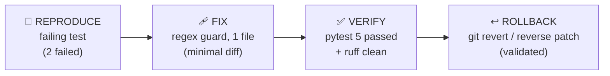

# Minimal Safe Change (I3 — `Intermediate/minimal-safe-change`)

Proves the **smallest safe change** workflow — *reproduce → minimal fix → before/after
tests → rollback* — entirely **in-repo**, so an evaluator can verify it from a clone
alone with no external SDK or monorepo.

A realistic date-parser bug (lenient `DD-MM-YYYY` parsing silently mis-reading
`YYYY-MM-DD HH:mm` and returning a garbage **negative** timestamp) was *seeded* into
`sandbox/app/datetime_utils.py`, reproduced with a failing test, root-caused, fixed with
a **one-file** regex guard, and verified. The repo contains the **fixed** code; the
before/after evidence is in `VERIFICATION_RESULTS.md`.

> This Python sandbox is a faithful mirror of a real Flutter fix on
> `android-monorepo/flutter/pml-flutter` (`DateTimeUtils.dateStringToTimestamp`). That
> Flutter work is preserved as an **optional extended example** in
> `docs/agent-analysis/I3_safe_change.md`; the sandbox is the **primary** clone-only proof.

## The workflow



## Structure

```text
Intermediate/minimal-safe-change/
├── I3_agent.md                 # canonical agent spec (single source of truth)
├── README.md                   # this file
├── SPEC.md                     # date-parser business rules + seeded-bug disclosure
├── VERIFICATION_RESULTS.md     # real before/after pytest + ruff + caller-search output
├── RUBRIC.md                   # AI-judge weighted scoring (sums to 100)
├── sandbox/                    # ← PRIMARY verification path (self-contained)
│   ├── app/
│   │   ├── __init__.py
│   │   └── datetime_utils.py   # date_string_to_timestamp() — fixed (seeded bug, see SPEC)
│   ├── tests/test_datetime_utils.py
│   ├── requirements.txt        # pytest
│   └── pytest.ini
├── artifacts/
│   ├── i3-sandbox-fix.patch    # buggy→fixed unified diff (git apply-able)
│   ├── i3-sandbox-fix.diff     # same diff for tooling
│   ├── pml-flutter-date-fix.patch  # Flutter fix — reference fragment (NOT applicable here)
│   └── metadata.json           # machine-readable summary
├── scripts/
│   ├── caller_search.sh        # ripgrep-based inbound-caller table + count
│   └── check-i3-sync.sh        # fails CI if SKILL.md drifts from I3_agent.md
└── docs/agent-analysis/I3_safe_change.md   # the worked artifact (Flutter + Python)
```

## Quick start

```bash
cd Intermediate/minimal-safe-change/sandbox
python3 -m venv .venv && source .venv/bin/activate
pip install -r requirements.txt ruff
pytest -v          # 5 passed
ruff check .       # All checks passed!
```

Or, from the **repo root**, the monorepo entrypoint (creates the venv, installs,
runs pytest + ruff + the spec-sync guard):

```bash
make i3-verify          # standalone I3 verification
make test               # full suite — now includes i3-verify
mise run i3-verify      # equivalent via mise task
```

> **Integration choice:** `i3-verify` is both a standalone target *and* wired into the
> aggregate `test` target (`test: rust node python i3-verify`), so the I3 sandbox is
> covered by `make test` / `make bootstrap` while staying independently runnable.

## See the bug reproduced

The committed code is fixed. To watch the seeded bug fail, reverse-apply the patch and
re-run:

```bash
cd sandbox
git apply --reverse ../artifacts/i3-sandbox-fix.patch
pytest -v          # 2 failed (the YYYY-MM-DD HH:mm cases) → -61405935300
git apply ../artifacts/i3-sandbox-fix.patch    # restore the fix
```

## The seeded bug & fix, in one line

```diff
# sandbox/app/datetime_utils.py :: date_string_to_timestamp
+    if re.match(r"^\d{4}-\d{2}-\d{2} \d{2}:\d{2}", date_string):   # route ISO to the strict
+        return _parse_iso_space(date_string)                       # formatter before the
     return _parse_lenient_dmy(date_string)                         # lenient DD-MM-YYYY parser
```

## Rollback

Pure in-memory parsing — no database/state changes. Revert is a clean undo:

```bash
git revert <commit-sha>                      # after merge, or
git apply --reverse artifacts/i3-sandbox-fix.patch   # restore buggy state from sandbox/
```

## Extended (optional) — the Flutter original

The Dart fix this sandbox mirrors lives on branch `fix/i3-date-string-yyyy-mm-dd-parse`
in `android-monorepo/flutter/pml-flutter` (not vendored here). `make i3-flutter-verify`
runs it **only if** a Flutter SDK is present and skips cleanly otherwise — bootstrap
never depends on Flutter. Details + the documented diff:
`docs/agent-analysis/I3_safe_change.md`.

## Links

- Agent spec: [`I3_agent.md`](I3_agent.md) (mirrored by `skills/tasks-safe-change/SKILL.md`)
- Business rules: [`SPEC.md`](SPEC.md)
- Proof: [`VERIFICATION_RESULTS.md`](VERIFICATION_RESULTS.md)
- Scoring: [`RUBRIC.md`](RUBRIC.md)
- Artifact: [`docs/agent-analysis/I3_safe_change.md`](docs/agent-analysis/I3_safe_change.md)
