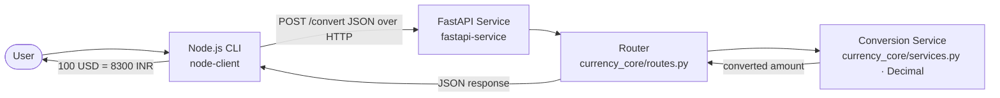

# I4 — Polyglot Currency Conversion System (FastAPI + Node.js CLI)

A two-component polyglot system that demonstrates cross-language communication over HTTP:

- **`fastapi-service/`** — a thin Python FastAPI shell exposing `POST /convert` (hardcoded rates).
- **`node-client/`** — a Node.js CLI that calls the service and prints the result.

The conversion logic, schemas, and HTTP router live **once** in the shared
[`currency-core`](../shared/currency-core) package (`Intermediate/shared/currency-core`), which
this service editable-installs and the I5 dockerized service also mounts — no duplicated logic.

Everything is runnable and verifiable from a fresh clone with **one command**.

> **Toolchain (pinned by `mise.toml`):** Python **3.12.7** · Node **22.11.0**.
> **Contract:** [`CONTRACT.md`](CONTRACT.md) is the single locked source of truth.

---

## One-command verification

```bash
# from the repo root (Task_Eval/)
make i4-verify
```

This single target (see the root `Makefile`):

1. builds the service venv under the pinned Python and editable-installs `currency-core`;
2. runs the **shared `currency_core`** unit tests (8) — `pytest`;
3. runs the **service** tests (23) — `pytest` with `TestClient`;
4. runs the **perf gate** — `bench_convert.py` asserts p50 `POST /convert` < 10 ms;
5. installs Node deps and runs the **client** tests (17) — `jest`;
6. runs the **live integration** — boots the real service and drives the real CLI over HTTP for
   all 6 rate pairs and all 4 exit codes (`integration-tests/run_integration.sh`).

Warm (deps already installed) it completes in **~13 s** — well under the 60 s budget.

---

## Architecture Diagram



---

## Folder Structure

```text
polyglot-currency-pair/
├── fastapi-service/
│   ├── app/
│   │   ├── __init__.py
│   │   └── main.py            # thin app: mounts currency_core router + /health
│   ├── tests/test_convert.py  # 23 service tests (TestClient)
│   ├── bench_convert.py       # perf gate (p50 POST /convert < 10ms)
│   ├── requirements.txt       # editable-installs ../../shared/currency-core
│   ├── pytest.ini
│   └── README.md
├── node-client/
│   ├── src/convert.js         # CLI: parse → call (string amount + timeout) → format
│   ├── tests/convert.test.js  # 17 client tests (mocked HTTP client)
│   ├── package.json
│   └── README.md
├── integration-tests/
│   └── run_integration.sh     # live E2E: 6 rate pairs + 4 exit codes over HTTP
├── docs/agent-analysis/I4_polyglot_service.md
├── CONTRACT.md                # locked request/response/error/exit-code contract
├── VERIFICATION_RESULTS.md    # captured run evidence (pinned toolchain)
└── README.md                  # this file

../shared/currency-core/        # shared package (schemas, services, routes) + 8 core tests
```

---

## Manual setup (two terminals)

**Terminal 1 — start the FastAPI service:**
```bash
cd fastapi-service
mise exec -- python -m venv .venv && source .venv/bin/activate
pip install -r requirements.txt          # also editable-installs currency-core
uvicorn app.main:app --port 8000
```

**Terminal 2 — run the Node CLI:**
```bash
cd node-client
mise exec -- npm install
node src/convert.js 100 USD INR
# -> 100 USD = 8300 INR
```

The CLI targets `http://localhost:8000` by default; override with `API_URL`, and tune the
request timeout with `API_TIMEOUT_MS` (default `5000`):
```bash
API_URL=http://localhost:9000 API_TIMEOUT_MS=2000 node src/convert.js 100 USD INR
```

---

## API Contract (summary — see [`CONTRACT.md`](CONTRACT.md))

`POST /convert` — request `{ "amount": "100", "from": "USD", "to": "INR" }`

| Case | Status | Body |
|---|---|---|
| Success | `200` | `{ "converted_amount": 8300, "from": "USD", "to": "INR" }` |
| Non-positive amount | `422` | `{"error": "Amount must be positive"}` |
| Unsupported currency | `400` | `{"error": "Unsupported currency"}` |
| Malformed / non-finite / out-of-range | `422` | FastAPI `{"detail": [...]}` |

Amounts are handled as exact **`Decimal`** end-to-end (never binary `float`); the CLI sends the
amount as a **string** to preserve precision in transit.

---

## Supported Currencies & Rates

`USD`, `INR`, `EUR` — hardcoded (same-currency uses rate 1):

| From → To | Rate | `100` → |
|---|---|---|
| USD → INR | 83    | 8300 |
| USD → EUR | 0.92  | 92   |
| INR → USD | 0.012 | 1.2  |
| EUR → USD | 1.08  | 108  |
| INR → EUR | 0.011 | 1.1  |
| EUR → INR | 90    | 9000 |

See `docs/agent-analysis/I4_polyglot_service.md` and `VERIFICATION_RESULTS.md` for full evidence.
