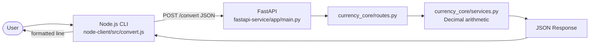
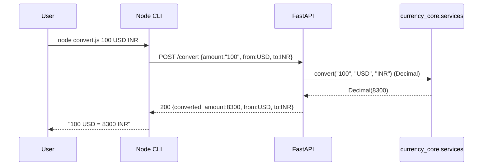

# I4 — Polyglot Service Pair (FastAPI + Node.js CLI)

> Build + integration report for the currency-conversion polyglot system.
> Status: **BUILT, TESTED, AND INTEGRATION-VERIFIED (one-command, pinned toolchain).**
> FastAPI (**Python 3.12.7**, pydantic 2) · Node.js **v22.11.0** (axios + jest) — pinned by `mise.toml`.
> Contract: [`CONTRACT.md`](../../CONTRACT.md). Reproduce everything with `make i4-verify`.

---

## System Overview

Two components communicating over HTTP REST. The conversion logic, schemas, and router live
**once** in the shared `currency_core` package (`Intermediate/shared/currency-core`), editable-
installed by the service and also mounted by the I5 dockerized service — no duplicated logic.



---

## Component Responsibilities

| Component | Responsibility |
|---|---|
| FastAPI `app/main.py` | App bootstrap, router mount, `/health` (the **only** file local to the service) |
| `currency_core/routes.py` | HTTP boundary; maps typed service errors → 200/400/422 |
| `currency_core/services.py` | Conversion logic + hardcoded rates; **Decimal** arithmetic; raises `InvalidAmountError` / `UnsupportedCurrencyError` |
| `currency_core/schemas.py` | Pydantic request validation — Decimal amount, finite, ≤ 20 digits / ≤ 6 dp; `from`/`to` via alias |
| Node `src/convert.js` | Parse args (string-safe amount) → call API (injectable client, timeout) → format/print → exit code |

Conversion logic lives only in `currency_core/services.py` — **never in routes**.

---

## API Contract

`POST /convert` (see [`CONTRACT.md`](../../CONTRACT.md) for the full locked spec)

```json
// request — amount may be a number or a decimal string (CLI sends a string)
{ "amount": "100", "from": "USD", "to": "INR" }
// success 200
{ "converted_amount": 8300, "from": "USD", "to": "INR" }
```

| Case | Status | Body |
|---|---|---|
| Success | 200 | `{converted_amount, from, to}` |
| Non-positive amount | 422 | `{"error": "Amount must be positive"}` |
| Unsupported currency | 400 | `{"error": "Unsupported currency"}` |
| Malformed / non-finite / out-of-range | 422 | FastAPI `{"detail": [...]}` |

---

## Precision & Validation Strategy

**Money is exact `Decimal`, never binary `float`.** The CLI sends `amount` as a **string** so no
precision is lost in transit; the service coerces via `Decimal(str(x))` and quantises results
HALF_UP to 6 decimal places (integral → int like `8300`; fractional → trimmed like `1.2`).

Two validation tiers, by design:
1. **Structural (`schemas.py` / Pydantic):** `amount` present, finite (NaN/±Infinity rejected),
   ≤ 20 significant digits, ≤ 6 decimal places; `from`/`to` required strings. Failures → 422 with
   FastAPI's `detail` envelope (the "malformed" case).
2. **Business (`services.py`):** `amount > 0` → else `InvalidAmountError` (422, custom message);
   currency ∈ {USD, INR, EUR} and pair has a rate → else `UnsupportedCurrencyError` (400).

Order: amount-positivity is checked before currency support.

---

## Error Handling

- **Service:** the Node CLI inspects the axios error — `e.response` (non-2xx) → print server's
  `error` message, exit 1; timeout (`ECONNABORTED`/`ETIMEDOUT`) → "timed out", exit 3;
  `e.request`/`ECONNREFUSED` (no response) → "API unavailable", exit 3.
- **Args:** `parseArgs`/`parseAmount` throw → exit 2 with usage/message (no HTTP call made).
- **API:** typed exceptions mapped to exact status codes in `routes.py`.

---

## Testing Strategy

- **Core (`pytest`, 8):** pure `currency_core.services` logic — Decimal exactness, case-insensitivity,
  same-currency, fractional preservation, non-positive & unsupported errors.
- **Service (`pytest` + `TestClient`, 23):** all 6 rate pairs, same-currency, string-amount precision,
  the three error classes, NaN/±Infinity rejection, magnitude & precision bounds, response shape,
  `/health`, OpenAPI `/convert` contract.
- **Client (`jest`, 17, mocked HTTP client):** `parseAmount`/`parseArgs`/`formatResult` units +
  `run()` for success, unsupported (mock 400), connection-refused, timeout, bad args, non-positive.
  The client tests need **no running server** (dependency-injected mock), so they are fast and deterministic.
- **Integration (`run_integration.sh`):** real server + real CLI over HTTP — all 6 rate pairs and all
  4 exit codes, plus a string-precision check.
- **Perf (`bench_convert.py`):** in-process p50 `POST /convert` gated < 10 ms.

---

## Integration Flow



---

## Known Limitations

- **Hardcoded rates**, fixed currency set (USD/INR/EUR); same-currency conversions use rate 1.
- **No persistence / no auth / no rate-limiting** — it's a demonstration service.
- Rates are static — no live FX feed; production would source and cache rates with a TTL.
- **No retry/backoff** in the client; a single failed call surfaces immediately (a timeout is bounded).
- `npm audit` reports advisories in the transitive jest dev-tree (not runtime) — out of scope.

---

# AGENT GENERATED

**Files (this task)**
```
fastapi-service/app/{__init__,main}.py        # thin shell (logic is in currency_core)
fastapi-service/tests/test_convert.py         # 23 service tests
fastapi-service/bench_convert.py              # perf gate
fastapi-service/{requirements.txt, pytest.ini, README.md}
node-client/src/convert.js                    # string-safe amount + timeout, 4 exit codes
node-client/tests/convert.test.js             # 17 client tests
node-client/{package.json, README.md}
integration-tests/run_integration.sh          # live E2E (6 pairs + 4 exit codes)
CONTRACT.md                                    # locked contract
docs/agent-analysis/I4_polyglot_service.md
README.md  ·  VERIFICATION_RESULTS.md
../shared/currency-core/currency_core/{schemas,services,routes}.py + tests/test_core.py (8)
```
- **Architecture:** router/service/validation split (FastAPI, shared `currency_core`); parse/call/format split (Node) with injectable HTTP client.
- **Implementation:** `POST /convert`, hardcoded rates, **Decimal** money, typed errors → status codes; CLI with timeout + 4 exit codes.
- **Tests:** 8 core + 23 service pytest + 17 jest; live integration (11 checks); perf gate.
- **Documentation:** root + per-component READMEs + CONTRACT + this file; system + sequence Mermaid diagrams.

---

# VERIFIED RESULTS

All commands executed under the pinned toolchain (Python 3.12.7 / Node 22.11.0). Full captured
output — including the perf gate and the live integration — is in
[`VERIFICATION_RESULTS.md`](../../VERIFICATION_RESULTS.md). Summary:

| Check | Command | Result |
|---|---|---|
| Core tests | `pytest ../../shared/currency-core/tests` | 8 passed |
| Service tests | `pytest -q` | 23 passed |
| Client tests | `npm test` | 17 passed |
| Perf gate | `python bench_convert.py` | p50 ≈ 0.9 ms (< 10 ms) |
| Live integration | `run_integration.sh` | 11/11 checks (6 pairs + 4 exit codes) |
| **One command** | **`make i4-verify`** | **all green, ~13 s warm** |

---

## Deliverables Checklist

- [x] FastAPI service (thin shell over shared `currency_core`)
- [x] POST /convert endpoint (Decimal money)
- [x] Input validation (structural + business tiers; NaN/inf/precision/magnitude)
- [x] Error handling (200/400/422; CLI 4 exit codes incl. timeout)
- [x] Core tests (8) + Service tests (23) + Client tests (17)
- [x] Automated live integration script (6 pairs + 4 exit codes)
- [x] Performance benchmark + gate (p50 < 10 ms)
- [x] Locked `CONTRACT.md`
- [x] Architecture + sequence diagrams
- [x] README files (root + 2 components) with accurate paths
- [x] `make i4-verify` single-command verification
- [x] Verification evidence (captured under pinned toolchain)
