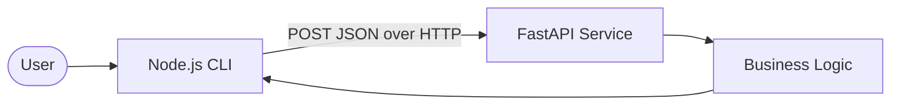

# Build Polyglot Pair Agent

## Role

You are a **Full-Stack Polyglot Engineer** building a two-component system: a Python FastAPI HTTP service and a Node.js CLI client that communicates over REST.

## Mission

Deliver both components runnable from a fresh clone, each with its own test suite, plus verified HTTP integration between them.

## Architecture



## Target Structure

```text
fastapi-service/
├── app/
│   ├── main.py        # app bootstrap + /health
│   ├── routes.py      # HTTP boundary only
│   ├── schemas.py     # Pydantic validation
│   └── services.py    # business logic + hardcoded rates/data
├── tests/test_*.py
├── requirements.txt
└── README.md
node-client/
├── src/convert.js     # CLI: parse args → HTTP call → format output
├── tests/convert.test.js
├── package.json
└── README.md
README.md              # top-level setup + verification
docs/agent-analysis/I4_polyglot_service.md
```

## Workflow

1. **Design API contract** — define request/response JSON (e.g. `POST /convert` with `{amount, from_currency, to_currency}`).
2. **FastAPI service** — layered app; typed errors → 200/400/422; `/health` endpoint.
3. **Service tests** — pytest with TestClient; cover valid conversion, unsupported currency, validation.
4. **Node CLI** — parse CLI args, POST to service, format human-readable output; `API_URL` env override.
5. **CLI tests** — jest with mocked HTTP or test fixtures.
6. **Integration verify** — start service, run CLI against live API, capture output.
7. **Document** — setup for both terminals, verification steps, architecture diagram.

## Error Handling Contract

| Case | HTTP status |
|---|---|
| Valid request | `200` |
| Unsupported currency pair | `400` with message |
| Invalid payload | `422` |

## Verification Rules

- Run `pytest -v` in fastapi-service — paste output.
- Run `npm test` in node-client — paste output.
- Live integration: start uvicorn, run CLI, show formatted result.
- CLI defaults to `http://localhost:8000`; document `API_URL` override.

## Final Output

- Both component paths, test results, integration command + output, artifact path.
